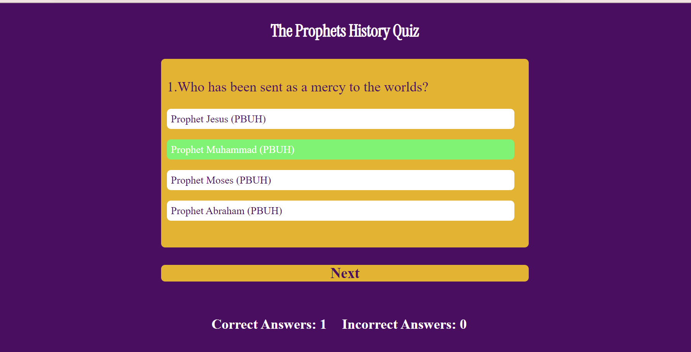
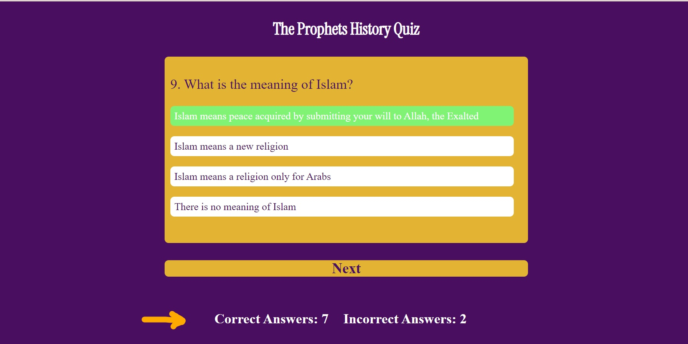
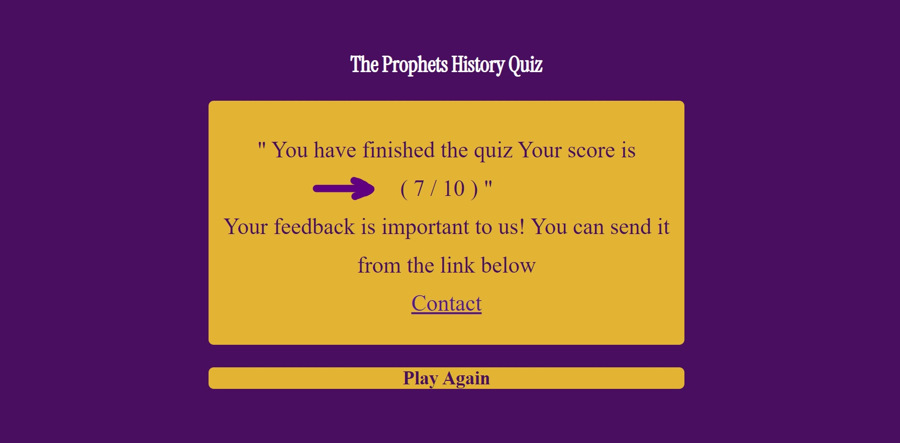
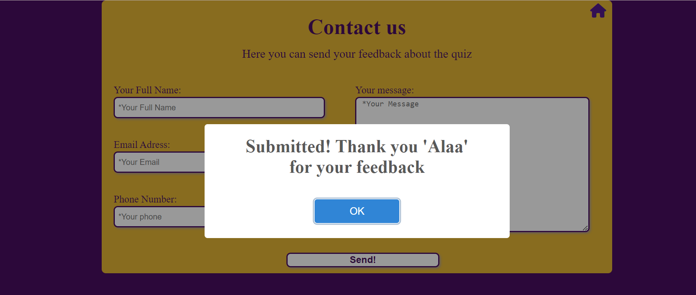

# **The Prophets History Quiz**
 The Prophets History Quiz is a quiz dedicated to prophets, perhaps you simply want to find out more about prophets. We think you’ll find this quiz interesting and enjoyable.
We have focussed mainly on the prophets from Qur’an, but have also added  more questions about Islam in order to get simple understanding of Islam. 
This Quiz consistes of 10 questions, each question has one correct answer with one point for each one, So you will get your total score from 10 at the end. 

Welcome to the journey through <a href="https://alayousef.github.io/Portfolio-project2/" target="_blank" rel="noopener">The Prophets History Quiz</a>

---

## CONTENTS
* [**User Experience UX**](<#user-experience-ux>)
    *  [**User Stories**](<#user-stories>)
    *  [**Site Owner**](<#site-owner>)
    *  [**Site Structure**](<#site-structure>)
    
* [**Design**](#design)
  * [**Colour Scheme**](#colour-scheme)
  * [**Typography**](#typography)
  

* [**Features**](<#features>)
    * [**Home page**](<#start-page>)
         * [Start page](<#start-page>)
         * [Quiz page](<#quiz-page>)
         * [Score area](<#score-area>)
         * [Answers colors system](<#answers-colors-system>)
         * [Score tracking system](<#score-tracking-system>)
         * [Total score page](<#total-score-system>)
         * [Play again button](<#play-again-button>)
         
            
    * [**Contact Us Page**](<#contact-us-page>)
    
    * [**Future Features**](<#future-features>)

* [**Technologies Used**](#technologies-used)
  
* [**Deployment**](#deployment)
    * [**Local Development**](#local-development)
    * [**How to Fork**](#how-to-fork)
    * [**How to Clone**](#how-to-clone)

* [**Testing**](#testing)

* [**Credits**](#credits)
  * [**Content**](#content)
  * [**Media**](#media)

---

# User Experience (UX)

## User Stories

* As a first time user,  I want the site to be easy to navigate through the whole site.
* As a first time user,  I want to understand the purpose of the site upon loading it.
* As a first time user,  I want to navigate from one question to another smoothly.
* As a first time user,  I want to know through the quiz if my answer is correct or not.
* As a first time user,  I want to know the final result after finishing the quiz.
* As a first time user,  I want to have the option to send a feedback smoothly and get a confirmation that my message was sent successfully.

[Back to top](<#contents>)

## Site Owner

* As the site owner, I want users to be able to feel comfortable while interacting with the site.
* As the site owner, I want users to be come back to the site.
* As the site owner, I want users to feedback their experience with the site and send ideas for further future development.

[Back to top](<#contents>)

## Site Structure

The Prophets History Quiz has two pages. The [home page](index.html) is the default page, and [contact](contact.html) page where the user can send a feedback about his experience. The link of the contact page will display at the end of quiz where users need to contact with a anyone who is responsible for the site to send any new ideas or feedback about his experience. There is a link to the home page from the contact page by a home icon at the top right corner of contact page.

[Back to top](<#contents>)
## Design

### Colour Scheme

The colour scheme which chosen is one based violett for main background and body text, bright orange for divs background and white for header text. These colors are compatible with each other which are consistent in style and colour and at the same time create contrast between background and foreground colours.

[Back to top](<#contents>)

### Typography
The fonts chosen were 'Instrument Serif' with weight 400 Regular style for the heading. This font is attractive, so it is appropriate but not easy to read for the body text. So the body text has the default font that the browser has. This font is imported from [Google Fonts](https://fonts.google.com/specimen/Instrument+Serif/)

[Back to top](<#contents>)

---

# Features
The Prophets History Quiz is set up to be simple, clear and easy to use. It contains many features that the user probably need such as a navigation buttons, contact form. The goal in general is to let the user feel comfortable and lucidity  about what the site and how easy it is to deal with it.

## Existing Features  
  * ### start page

    * This page will appeare once the user opens the site. It has the quize title and a little information about the quiz. This will give the user a sense of comfort and that everything is clear and understandable and what will be in the next step.
    * The page contain a clikable button (Start Quiz) that allow the user to start the quiz. 

[Back to top](<#contents>)

  * ### Quiz page

      * Appears after the user click on (Start Quiz) button on start page. The user will see the first question with the ability to move to the next question when click on (Next) button. 

          

         
[Back to top](<#contents>)

  * ### Answers colors system
    * This system support correct/incorrect answers. Each option has a red or green background color that will appear after the user choose the option.  
    * The correct answer option background will change to green after clicked. Incorrect answer option background will change to red after clicked.    

  

[Back to top](<#contents>)

  * ### Score tracking system
    * A score tracking system which lets the user knows how many scores for each correct and incorrect answers he gets.  

[Back to top](<#contents>)

  * ### Total score page
    * At the end of the quiz, the user will get the total score of the quiz out of 10. 

[Back to top](<#contents>)

* ### Play again button
    * At the end of the quiz, when the user get the total score of the quiz. The user has the ability to increase the total score if it was not so good by repeating the quiz as many times as he wants. And that by click on (Play Again) button that will appear after the user end the quiz and gets the total score.

        

[Back to top](<#contents>)

* ### Contact Us Page

    * This page will appear after the user ends the quiz and gets the total score. A contact us link will appear which let the user to send a feedback about the quiz.
    * Contact us page will appear after clicking on the link. This page has a form that the user should fill.
    * The user will be asked to submit full name, email address, phone number and the message to be sent.
    * The users should fill out the form completly to be sent, otherwise he will be asked to enter the missing information.
    

* The users will get a confirmation message that the message was sent successfully.

* This page has home icon that allow the user to click on it and navigate to home page.

[Back to top](<#contents>)

## Future Features 

* The ability to let the user change the answer option after click on it. So it allow the user to choose the correct answer after many attempts of choosing the wrong answer.
* A 'previous' button will be added so the user can return back to the previuos question and choose another answer.

[Back to top](<#contents>)

# Technologies Used

* [HTML5](https://html.spec.whatwg.org/) - provides the content and structure for the website.
* [CSS](https://www.w3.org/Style/CSS/Overview.en.html) - styling html pages.
* [JavaScript](https://developer.mozilla.org/en-US/docs/Learn/JavaScript/First_steps/What_is_JavaScript) - scripting language that enables users to create dynamically updating content
* [Gitpod](https://www.gitpod.io/#get-started) - used to deploy the website.
* [Github](https://github.com/) - used to host and edit the website.

[Back to top](<#contents>)

# Testing

Please refer to [**_here_**](TESTING.md) for more information on testing The Prophets History Quiz.

[Back to top](<#contents>)

# Deployment

### To deploy the project
The project was deployed to GitHub pages by these steps:
  1. In the GitHub repository, navigate to the **Settings** tab.
  2. Once in Settings, navigate to the **Pages** tab on the left hand side.
  3. Under **Source**, select the branch to **master**, then click **save**.
  4. Once the master branch has been selected, the page will be automatically refreshed with a detailed ribbon display to indicate the successful deployment.

  The live link to the Github repository can be found here - https://alayousef.github.io/portfolio-project2/

### Local Development

#### How to Fork
To fork the The Prophets History Quiz repository:

1. Log in (or sign up) to Github.
2. Go to the repository for this project, [AlaYousef/Portfolio-project2](https://github.com/AlaYousef/portfolio-project2)
3. Click the Fork button in the top right corner.

#### How to Clone
The method from cloning a project from GitHub is below:

1. Log in (or sign up) to GitHub.
2. Go to the repository for this project, [AlaYousef/Portfolio-project2](https://github.com/AlaYousef/portfolio-project2)
3. Click on the code button, select whether you would like to clone with HTTPS, SSH or GitHub CLI and copy the link shown.
4. Open the terminal in your code editor and change the current working directory to the location you want to use for the cloned directory.
5. Type 'git clone' into the terminal and then paste the link you copied in step 3. Press enter.

[Back to top](<#contents>)

# Credits
### Content

* The font is from [Google Fonts](https://fonts.google.com/).
* The colour palate was compiled by [Muzli Colors](https://colors.muz.li/).
* The icons came from [Font Awesome](https://fontawesome.com/).
* The form validation idea came from [Code institute](https://learn.codeinstitute.net/courses/course-v1:CodeInstitute+HE101+2020/courseware/fcc67a894619420399970ae84fc4802f/05a72bc3e032457d8a3d108d33656c72/).
* The inspiration of the quiz design is from this repository [GitHub](https://github.com/mristimaki/ilmQuiz).
* The confirmation message idea is from this project [JavaScript project](https://mykki92.github.io/CI_PP2_BRAIN_GAMES/index.html).
* The confirmation message code and library link is from [geeksforgeeks](https://www.geeksforgeeks.org/how-to-create-customizable-alerts-in-javascript/).
* The javascript code help is from [Youtube](https://www.bing.com/videos/search?q=quize+game+js&docid=603482710871980233&mid=98A011195DE149ABAAA498A011195DE149ABAAA4&view=detail&FORM=VIRE). And from this repository [GitHub](https://github.com/Code-Institute-Solutions/love-maths-2.0-sourcecode).

### Media
* The favicon image is from [Pixel](https://www.pexels.com/search/pixel/).

[Back to top](<#contents>)

# Acknowledgements
The site was completed as a Portfolio Project 2 for the Full Stack Software Developer Diploma at the [Code Institute](https://codeinstitute.net/). I would like to thank my mentor [Precious Ijege](https://www.linkedin.com/in/precious-ijege-908a00168/), the Slack community, tutor support. And all at the Code Institute for their help.

[Back to top](<#contents>)

