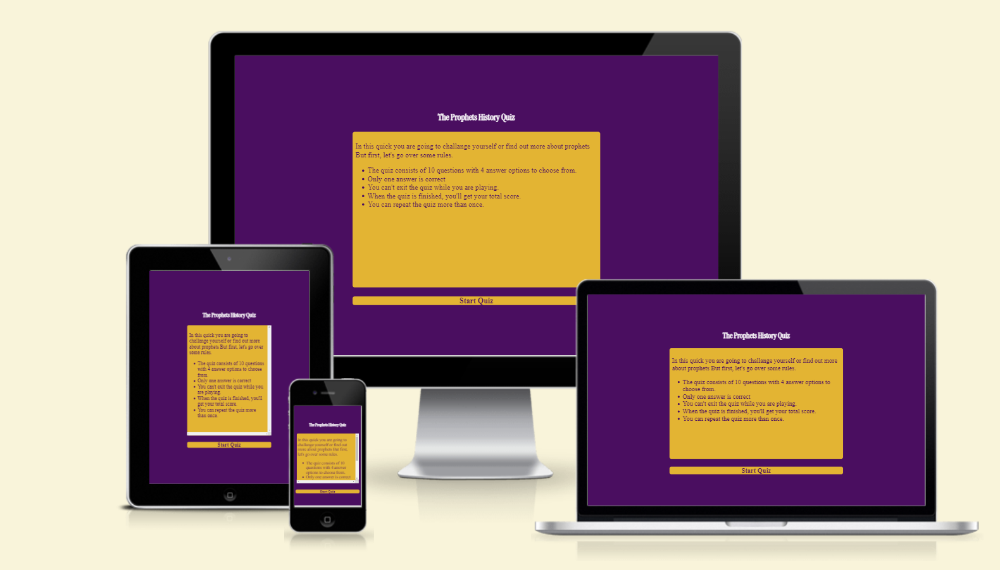

# **The Prophets History Quiz**
Arabic book fair is an exhibition for Arabic books in Sweden, Malmö city. The site targets Arabs in Sweden, where it will be useful to help in informing about details of the annual exhibition that will be held in addition to help people to reserve books from arabs countries to be available in the exhibition. 

Welcome to the journey through <a href="https://alayousef.github.io/Portfolio-project1/" target="_blank" rel="noopener">Arabic Book Fair</a>

---

## CONTENTS

* [**Design**](#design)
  * [**Colour Scheme**](#colour-scheme)
  * [**Typography**](#typography)
  

* [**Features**](<#features>)
    * [**Home page**](<#navigation-menu>)
         * [Navigation menu](<#navigation-menu>)
         * [Backround-cover-text](<#background-cover>)
         * [Fair-info section](<#fair-info>)
         * [Footer](<#footer>)
    * [**About Us Page**](<#about-us-page>)
        * About us information      
            
    * [**Contact Us Page**](<#contact-us-page>)
       * Contact details
       
    
    * [**Publishers Page**](<#publishers-page>)
        * Publishers houses

    * [**Future Features**](<#future-features>)

* [**Technologies Used**](#technologies-used)
  
* [**Deployment**](#deployment)
    * [**Local Development**](#local-development)
    * [**How to Fork**](#how-to-fork)
    * [**How to Clone**](#how-to-clone)

* [**Testing**](#testing)

* [**Credits**](#credits)
  * [**Content**](#content)
  * [**Media**](#media)

---

## Design

### Colour Scheme

The colour scheme which chosen is one based on blue colour in different shades. Blue considered one of the calm and comfort colors, carries the meanings of avoidence of tension and ability to communicates with others. This is something that we want hopefully pass onto the user. In addition to, dark blue helped to prevent distraction between foreground information and backgrounds.

[Back to top](<#contents>)

### Typography
The fonts chosen were 'merriweather' with weight 400 Italic style for the headings and the body text.

'Merriweather' was chosen to give the user a comfortable feeling while reading. It's easy, clear and understandable. This font is imported from [Google Fonts](https://fonts.google.com/specimen/Merriweather?query=Merriweather)

[Back to top](<#contents>)

---

# Features
Arab Book Fair site is set up to be simple, clear and easy to use. It contains many features that the user probably need such as a navigation bar, contact form and most importantly, the information that user is looking for will be found once he opens the site. The goal in general is to let the user feel comfortable and lucidity that what he want to know is exist in the site, clear, understandable and can obtain easily.

## Existing Features  
  * ### Navigation Menu

    * Sited at the top of all the pages in the site at the right side, it is contains links to all the pages of the site to enable ease of movement from one page to another in addition to, the user can know easily what page he is currently on.
    * The logo also is clickable and link to the home page.

[Back to top](<#contents>)

  * ### Backround-cover-text

      * Located on the background on the home page on right side. It was intended to allow user get a quick look about the fair details.

[Back to top](<#contents>)

  * ### Fair-info section
    * Fair info section lets the user know all details about the exhibition. Including the time, date and location, in addition to inforamtion about the activities that will be in the exhibition.

    * An intended map will help the user to get the exact location for the exhibition 

[Back to top](<#contents>)

* ### Footer
    
    * Footer section include links to the relevent social media sites for Arabic Book Fair in Sweden. And the links to social media platforms will open in a new tab to allow easy of navigation for the user.
    * The social media will help the user in research into Sweden Arab Book Fair pages in social media.
    

[Back to top](<#contents>)

* ### About Us Page

    * About us page give the user an overview about what is the arab book fair in Sweden, responsible parts and the reason for choosing the city in which the exhibition will be held.

[Back to top](<#contents>)

* ### Contact Us Page

    * This page will allow the user to get contact to Arab book fair to inquire about something related to the exhibition or book a specific books to be available in the exhibition.
    * The users will be asked to submit their full name, email address, phone number and the message he want.
    * The users should fill out the form completly to be sent, otherwise he will be asked to enter the missing information.
    

[Back to top](<#contents>)

* ### Publishers Page
    * The publishers page will provide the user with supporting images withe the most imporatnt publishing houses that will participate in the exhibition.
    * It provides a direct link that opens in a new tab back to see the books for each publishing houses that will be available in the exhibition.

[Back to top](<#contents>)
## Future Features 

* A 'Language' will be added in the navigation bar that would be help the users to translate the page into Arabic and Swedish to help users who doesn't know the English language. This would make the site closer to the user and more understandable.
* 'Gallary' page will be added for each annual exhibition that includes images of different activities that  take place in the exhibition.

[Back to top](<#contents>)

# Technologies Used
* [HTML5](https://html.spec.whatwg.org/) - provides the content and structure for the website.
* [CSS](https://www.w3.org/Style/CSS/Overview.en.html) - styling html pages.
* [Gitpod](https://www.gitpod.io/#get-started) - used to deploy the website.
* [Github](https://github.com/) - used to host and edit the website.

[Back to top](<#contents>)

# Testing

Please refer [**_here_**](TESTING.md) for more information on testing Wawas Woods.

[Back to top](<#contents>)

# Deployment

### To deploy the project
The project was deployed to GitHub pages by these steps:
  1. In the GitHub repository, navigate to the **Settings** tab.
  2. Once in Settings, navigate to the **Pages** tab on the left hand side.
  3. Under **Source**, select the branch to **master**, then click **save**.
  4. Once the master branch has been selected, the page will be automatically refreshed with a detailed ribbon display to indicate the successful deployment.

  The live link to the Github repository can be found here - https://alayousef.github.io/Portfolio-project1/

### Local Development

#### How to Fork
To fork the Arabic Book Fair repository:

1. Log in (or sign up) to Github.
2. Go to the repository for this project, [AlaYousef/Portfolio-project1](https://github.com/AlaYousef/Portfolio-project1)
3. Click the Fork button in the top right corner.

#### How to Clone
The method from cloning a project from GitHub is below:

1. Log in (or sign up) to GitHub.
2. Go to the repository for this project, [AlaYousef/Portfolio-project1](https://github.com/AlaYousef/Portfolio-project1)
3. Click on the code button, select whether you would like to clone with HTTPS, SSH or GitHub CLI and copy the link shown.
4. Open the terminal in your code editor and change the current working directory to the location you want to use for the cloned directory.
5. Type 'git clone' into the terminal and then paste the link you copied in step 3. Press enter.

[Back to top](<#contents>)

# Credits
### Content

* The font is from [Google Fonts](https://fonts.google.com/).
* The map is embedded from [Google Maps](https://www.google.com/maps).
* The colour palate was compiled by [Muzli Colors](https://colors.muz.li/).
* The icons came from [Font Awesome](https://fontawesome.com/).
* The form validation idea came from [Code institute](https://learn.codeinstitute.net/courses/course-v1:CodeInstitute+HE101+2020/courseware/fcc67a894619420399970ae84fc4802f/05a72bc3e032457d8a3d108d33656c72/).
* Background animation idea came from [W3Schools](https://www.w3schools.com/css/css3_animations.asp).
* In writing readme file, the readme file template was used from this repository on [GitHub](https://github.com/kera-cudmore/love-maths/blob/main/README.md).

### Media
* The images of home, about us, contact us pages backgrounds came from ,[Pixel](https://www.pexels.com/search/pixel/).
* The images of publishers page links came from [ArabiskaBazar](https://arabiskabazar.se/).

[Back to top](<#contents>)

