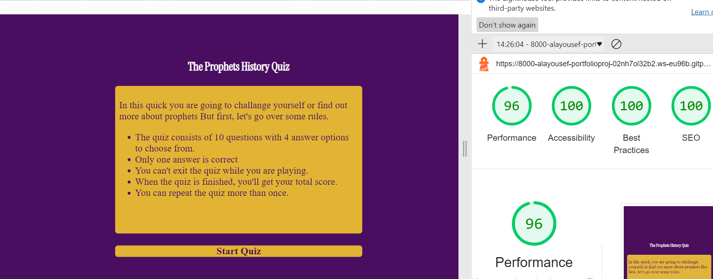

# Testing

## Code Validation
The Prophets History Quiz site code has been tested. All pages has been run through the [W3C html Validator](https://validator.w3.org/), the [Jigsaw Validator](https://jigsaw.w3.org/css-validator/) and the [jshint](https://jshint.com/) . One error and two warnings were found on HTML file. After fix and retest, no errors or warnings were found. 

The HTML validator results for all pages are below:

The CSS validator results are below:

The Javascript validator results for the script.js file (Index page Javascript file) are below:

The Javascript validator results for the contact-script.js file (Contact page Javascript file) are below:

## Responsiveness Test

* The responsive design were tested manually with [Google Chrome DevTools](https://developer.chrome.com/docs/devtools/). And on [amiresponsive](https://ui.dev/amiresponsive).

## Browser Compatibility

The Prophets History Quiz site was tested on Google Chrome, Microsoft Edge, Safari Firefox. Appearance, functionality and responsiveness were consistent throughout for a range of device sizes and browsers.
  

## Light House

The Prophets History Quiz was also tested using [Google Lighthouse](https://developers.google.com/web/tools/lighthouse) that provided by Google chrome Developer Tool for the following:
* Performance - How the page performs while loading.
* Accessibility - Is the site acccessible for users.
* Best Practices - Site conforms to industry best practices.
* SEO - These ensure that the page is following basic search engine optimization advice.

 ### Desktop results:

 ### Mobile results:

## Full Testing
`Home Page`

| Feature | Expected Outcome | Testing Performed | Result | Pass/Fail |
| --- | --- | --- | --- | --- |
| Start Button | Directs the user to the quiz page | Clicked on button | quiz page opens to display the contents | Pass |
| High Scores Button | Directs the user to the high scores page | Clicked on button | Directs to the high scores page | Pass |
| All options - hover effect | All answers options with violaceous text should change to white with violaceous background when hovered over. | Hover over each option on the page | Each option displayed the correct styling when hovered over | Pass |
| Next button - becomes visible | When a start is clicked the next button should be displayed so the user can progress to the next question, or to the end section if all 10 questions have been displayed| Clicked on an start button | The next question displayed | Pass |
| Next button - clicked | When clicked all answer styles should be removed and a new question and answer loaded. If all questions have been loaded the end result should appear | Clicked on the next button | All styles were removed and a new question and answers were displayed | Pass |
| Correct answer - background colour | When a correct answer is clicked the background color should display green | Clicked on a correct answer | background displayed green | Pass |
| Incorrect answer - background colour | When an incorrect answer is clicked the background color should display red | Clicked incorrect answer | background displayed red | Pass |
| Correct answer - score counter | When a correct answer is clicked correct score increase by 1 | Clicked a correct answer | correct answers counter increased | Pass |
| Incorrect answer - score counter | When an incorrect answer is clicked incorrect score increase by 1 | Clicked an incorrect answer | incorrect answers counter increased | Pass |
| Score Display | The  Score area should populate with the score the users have achieved | The total score of the correct answers is match with the result dispalyed | The score displays correctly | Pass |
| Play again button | Clicking on this button will return you to the start page where you can select a start the quiz again | Clicked on the play again button | Directed to the beginning of the quiz | Pass |
| Contact link | Clicking on this link will direct you to the contact us page where you can fill the form and send a feedback | Clicked on the contact link | Directed to the contact us page | Pass |

`Contact us Page`

| Feature | Expected Outcome | Testing Performed | Result | Pass/Fail |
| --- | --- | --- | --- | --- |
| Submit Button  | Once the user fills all input fields and click submit button, the input fields should reset and a confermation message should displayed | I filled the input fields except email input field and click submit, it displayed that you should fullfill all input fields to send the inputs and displays confermation message that the message has sent | display a confermation message and redirected to the contact us page | Pass |
| Home Icon | Clicking on this icon will take you back to the home page | Clicked the home icon | Directed back to the home page | Pass |

## Known Bugs
* ### Resolved

     * During validation one bug and two warnings shown during the validation stage of HTML page,which are:
     
 
     * During programming one problem was found on index page which is all divs displays at the same 
     time after I added the Javascript function (handleSubmit function) in Javascript file. Which is:

     

     * The solution was is to split Javascript functions for each page from each other into two seperate javascript files.
    

* ### Unresolved
    * The background color for each option does not change as expected when it is clicked and that happens for screens with max width 550px.