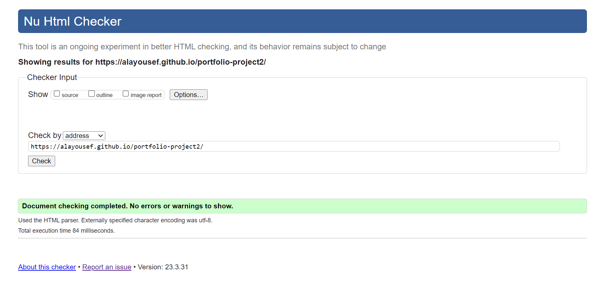
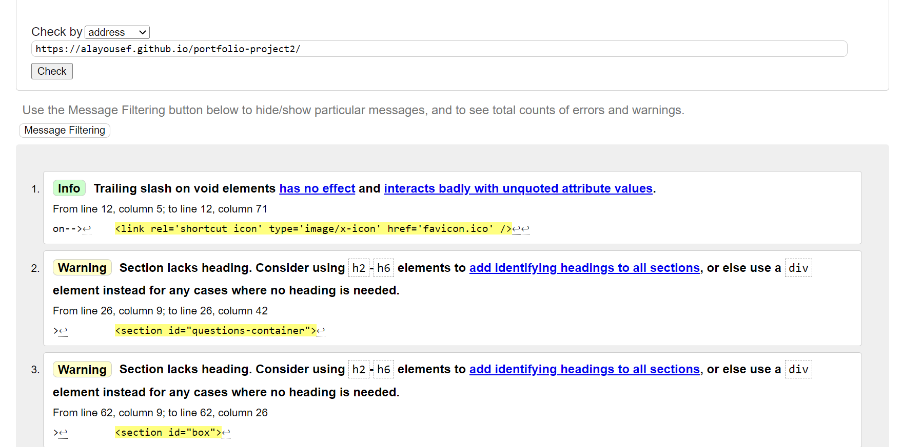
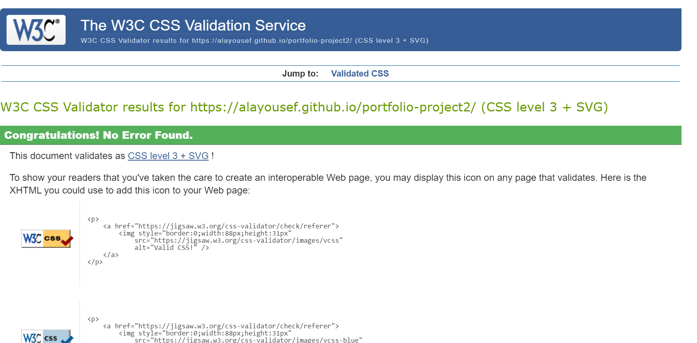
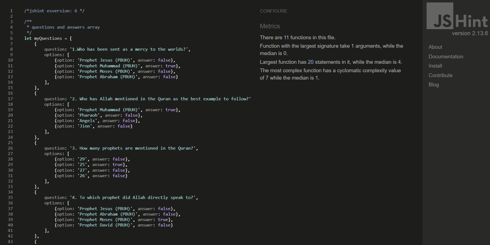
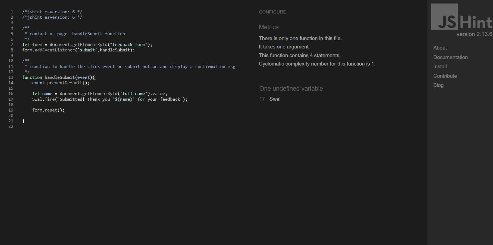
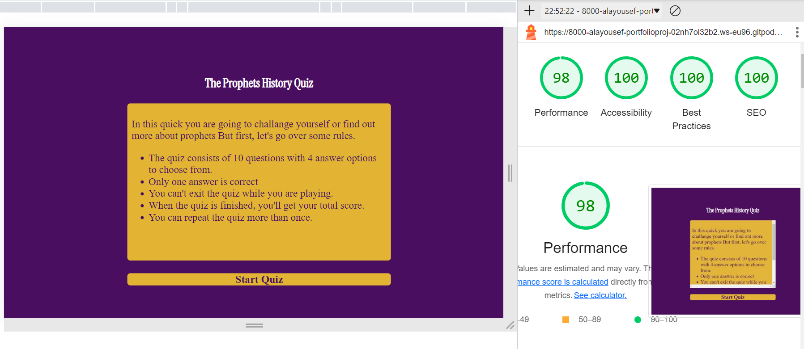
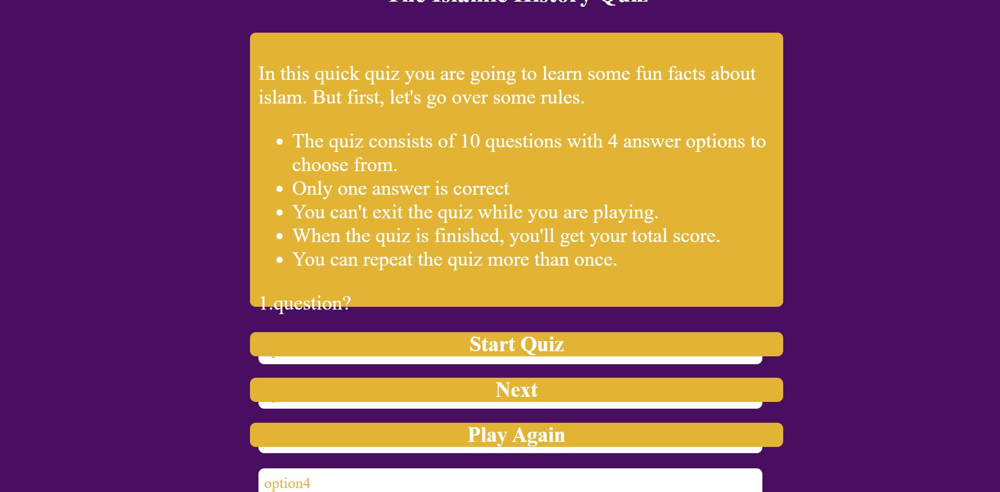

# Testing

## Code Validation
The Prophets History Quiz site code has been tested. All pages has been run through the [W3C html Validator](https://validator.w3.org/), the [Jigsaw Validator](https://jigsaw.w3.org/css-validator/) and the [jshint](https://jshint.com/) . One error and two warnings were found on HTML file. After fix and retest, no errors or warnings were found. 

The HTML validator results for all pages are below:

<<<<<<< HEAD

=======

>>>>>>> origin

The CSS validator results are below:

The Javascript validator results for the first file (Index page Javascript file) are below:

The Javascript validator results for the second file (Contact page Javascript file) are below:

## Responsiveness Test

* The responsive design were tested manually with [Google Chrome DevTools](https://developer.chrome.com/docs/devtools/). And on [amiresponsive](https://ui.dev/amiresponsive).

## Browser Compatibility

The Prophets History Quiz site was tested on Google Chrome, Microsoft Edge, Safari Firefox. Appearance, functionality and responsiveness were consistent throughout for a range of device sizes and browsers.
  

## Light House

The Prophets History Quiz was also tested using [Google Lighthouse](https://developers.google.com/web/tools/lighthouse) that provided by Google chrome Developer Tool for the following:
* Performance - How the page performs while loading.
* Accessibility - Is the site acccessible for users.
* Best Practices - Site conforms to industry best practices.
* SEO - These ensure that the page is following basic search engine optimization advice.

## Known Bugs
* ### Resolved

     * During validation one bug and two warnings shown during the validation stage of HTML page,which are:
    

     * During programming one problem was found on index page which is all divs displays at the same 
     time after I added the Javascript function (handleSubmit function) in Javascript file. Which is: 
    

    
     * The solution was is to split Javascript functions for each page from each other into two seperate js files.
    
 

* ### Unresolved
<<<<<<< HEAD
    * Defficulties of displaying questions from array. Until now the last question (number 10) is not displaying on questions div.
=======
    * The last question (number 10) could not display on questions div.
>>>>>>> origin
